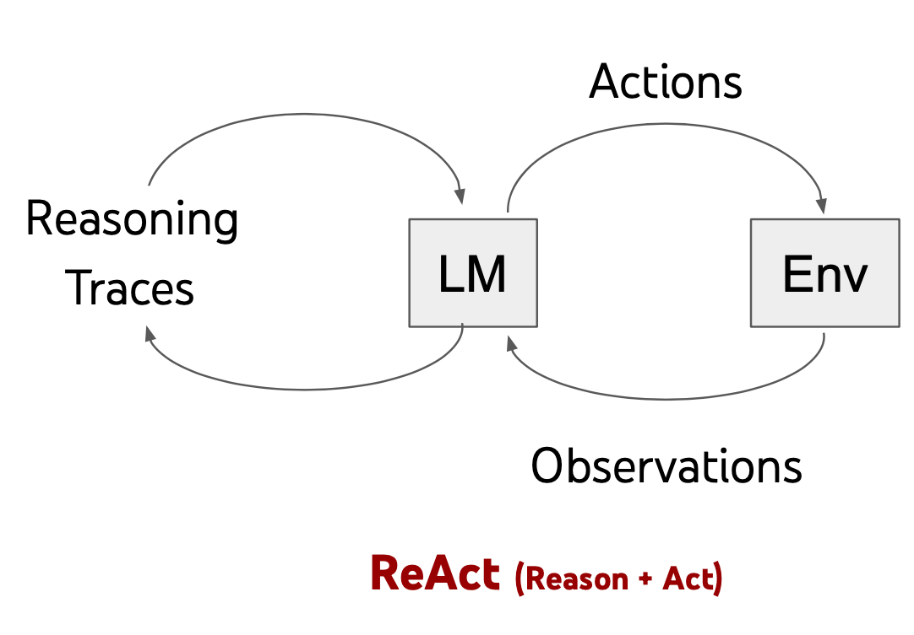

# LangChain 核心模块 Agent - ReAct


<!--more-->

## ReAct: Reasoning + Acting



ReAct Prompt 由 few-shot task-solving trajectories 组成，包括人工编写的文本推理过程和动作，以及对 动作的环境观察.

ReAct Prompt 设计直观灵活，并在各种任务上实现了最先进的少样本性能，从QA到在线购物


## ReAct 在获取新数据方面的优势（HotpotQA 示例）

- Reason-only baseline （即思维链）由于没有与外部环境接触以获取和更新知识，而且必须依赖有限的内部知识，因此容易受
  到错误信息（红色标记）的影响。
- Act-only baseline 缺乏推理能力方面问题，在这种情况下，尽管具有与ReAct相同的行动和观察，但无法综合得出最终答案。
  相比之下，ReAct通过可解释且真实可信的轨迹来解决任务。

## demo

```shell
from langchain.agents import load_tools
from langchain.agents import initialize_agent
from langchain.agents import AgentType
from langchain_openai import ChatOpenAI

from langchainAI.constants import model

llm = ChatOpenAI(model="ep-20250217170142-lrm2g", base_url=model.oneApiUrl,
                 api_key=model.oneApiKey, temperature=0.7, max_tokens=1000)
# 加载 LangChain 内置的 Tools
tools = load_tools(["serpapi", "llm-math"], llm=llm)

# 实例化 ZERO_SHOT_REACT Agent
agent = initialize_agent(tools, llm, agent=AgentType.CHAT_ZERO_SHOT_REACT_DESCRIPTION, verbose=True)
agent.invoke("谁是莱昂纳多·迪卡普里奥的女朋友？她现在年龄的0.43次方是多少?")

```

输出结果：

```shell
> Entering new AgentExecutor chain...


Action:
{
  "action": "Search",
  "action_input": "莱昂纳多·迪卡普里奥现任女友"
}

Observation:
莱昂纳多·迪卡普里奥现任女友是意大利超模维托里亚·塞雷蒂（Vittoria Ceretti），她出生于1998年6月7日，目前年龄为25岁（截至2023年）。

Thought: 现在需要计算25的0.43次方。

Action:
{
  "action": "Calculator",
  "action_input": "25^0.43"
}

Observation: 25^0.43 ≈ 4.7315

Thought: I now know the final answer

Final Answer: 莱昂纳多·迪卡普里奥的女朋友是维托里亚·塞雷蒂（Vittoria Ceretti），她现在的年龄25岁的0.43次方约为4.73。

> Finished chain.
```

从上面可以看出：llm先调用用search搜索出"莱昂纳多·迪卡普里奥现任女友",然后调用了Calculator计算次方，最后由大模型来推理总结。

## OPENAI FUNC

```shell
from langchain.memory import ConversationBufferMemory
from langchain_core.prompts import MessagesPlaceholder
from langchain_openai import ChatOpenAI

from langchainAI.constants import model
from langchain.agents import tool, AgentExecutor
from langchain.schema import SystemMessage
from langchain.agents import OpenAIFunctionsAgent

llm = ChatOpenAI(model="ep-20250217170142-lrm2g", base_url=model.oneApiUrl,
                 api_key=model.oneApiKey, temperature=0.7, max_tokens=1000)


@tool
def get_word_length(word: str) -> int:
    """Returns the length of a word."""
    return len(word)


tools = [get_word_length]
# 定义memory key
MEMORY_KEY = "chat_history"
memory = ConversationBufferMemory(memory_key=MEMORY_KEY, return_messages=True)
system_message = SystemMessage(content="你是非常强大的AI助手，但在计算单词长度方面不擅长。")
prompt = OpenAIFunctionsAgent.create_prompt(system_message=system_message,
                                            extra_prompt_messages=[MessagesPlaceholder(variable_name=MEMORY_KEY)])
agent = OpenAIFunctionsAgent(llm=llm, tools=tools, prompt=prompt)
# 实例化 OpenAIFunctionsAgent
agent_executor = AgentExecutor(agent=agent, tools=tools, memory=memory, verbose=True)

agent_executor.invoke("单词“educa”中有多少个字母?")
```

---

> 作者:   
> URL: https://yaobg.github.io/posts/notes/ai/langchain/agent/2-ask-react/  

