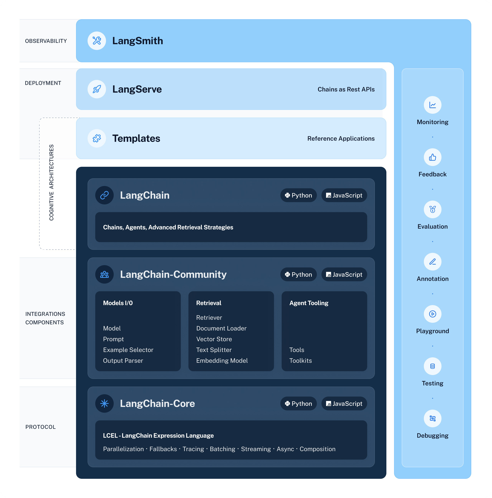
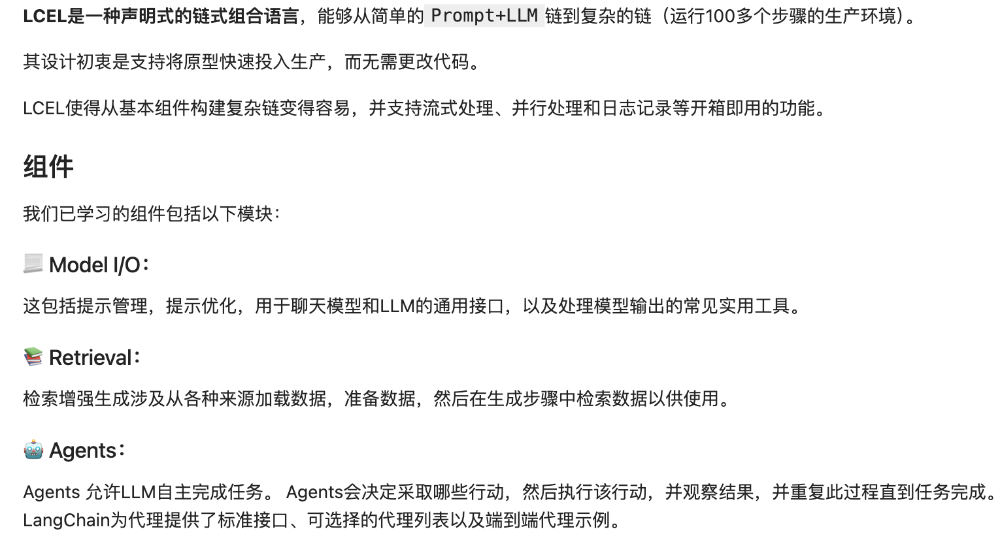
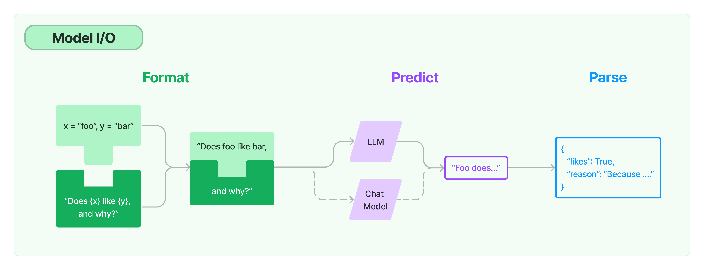
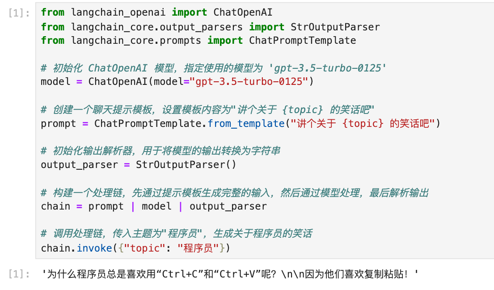
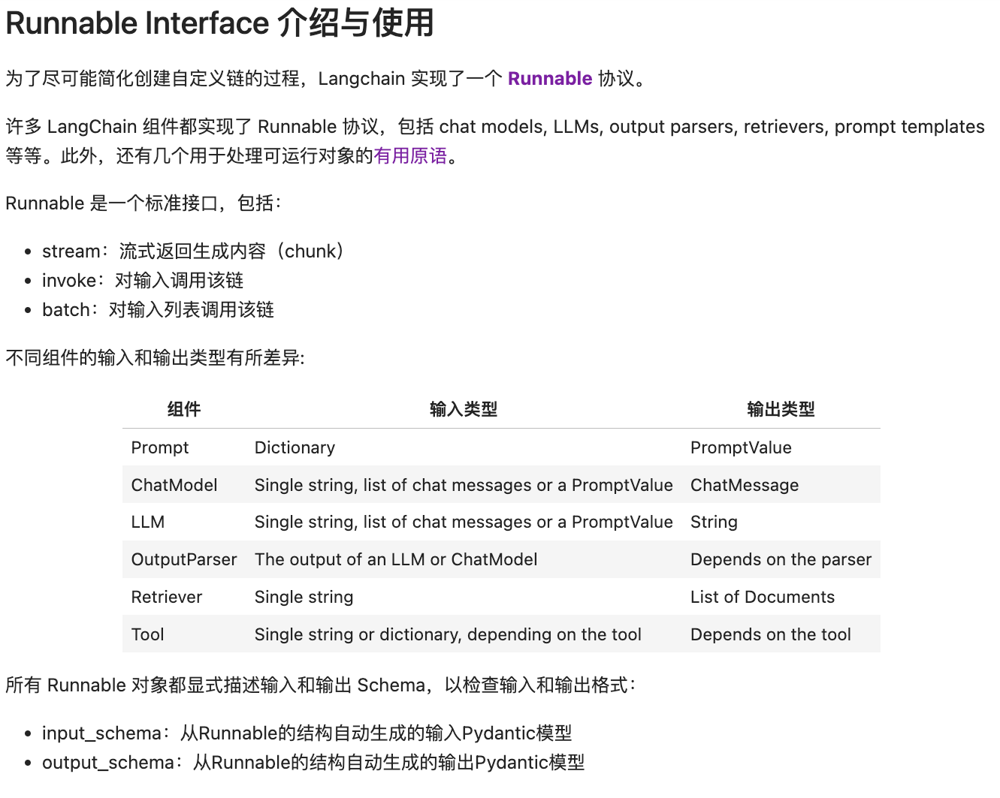
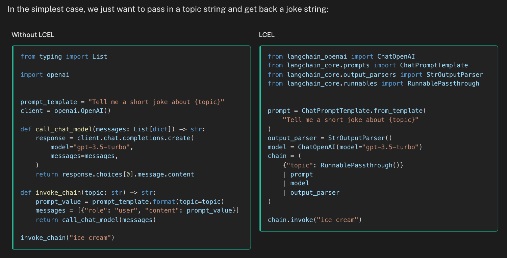

# LangChain 表达式语言（LCEL） 入门与实战


<!--more-->



- LangChain：LLMs 应用开发框架 LangChain-Community：第三方集成 LangChain-Core：LCEL 等协议
- LangChain Templates：开箱即用APP示例
- LangServe：Chains 生产部署（REST API）
- LangSmith：一站式开发者平台



## LCEL 设计理念与优势

标准化的大模型抽象 Model I/O



竖线符号类似于 Unix 管道操作符，它将不同的组件链接在一起，将一个组件的输出作为下一个组件的输入。



## LCEL Runnable 协议设计与使用



## LCEL vs LangChain 古典语法



## LCEL 进阶使用：整合复杂逻辑的多链
```shell
from operator import itemgetter

from langchain_core.output_parsers import StrOutputParser
from langchain_core.prompts import ChatPromptTemplate
from langchain_core.runnables import RunnablePassthrough
from langchain_openai import ChatOpenAI

from langchainAI.constants import model

m = ChatOpenAI(
    model="ep-20250217170142-lrm2g",
    base_url=model.oneApiUrl,
    api_key=model.oneApiKey,
    streaming=True,
)

planner = ChatPromptTemplate.from_template("生成关于以下内容的论点: {input}") | m | StrOutputParser() | {
    "base_response": RunnablePassthrough()}
# 创建正面论证的处理链，列出关于基础回应的正面或有利的方面
arguments_for = (
        ChatPromptTemplate.from_template(
            "列出关于{base_response}的正面或有利的方面"
        )
        | m
        | StrOutputParser())
# 创建反面论证的处理链，列出关于基础回应的反面或不利的方面
arguments_against = (
        ChatPromptTemplate.from_template(
            "列出关于{base_response}的反面或不利的方面"
        )
        | m
        | StrOutputParser()
)

# 创建最终响应者，综合原始回应和正反论点生成最终的回应
final_responder = (
        ChatPromptTemplate.from_messages(
            [
                ("ai", "{original_response}"),
                ("human", "正面观点:\n{results_1}\n\n反面观点:\n{results_2}"),
                ("system", "给出批评后生成最终回应"),
            ]
        )
        | m
        | StrOutputParser()
)
# 构建完整的处理链，从生成论点到列出正反论点，再到生成最终回应
chain = (
        planner
        | {
            "results_1": arguments_for,
            "results_2": arguments_against,
            "original_response": itemgetter("base_response"),
        }
        | final_responder
)
for chunk in chain.stream({"input": "房地产非常低迷"}):
    print(chunk, end="", flush=True)

```

---

> 作者:   
> URL: https://yaobg.github.io/posts/notes/ai/langchain/lcel/1-base/  

