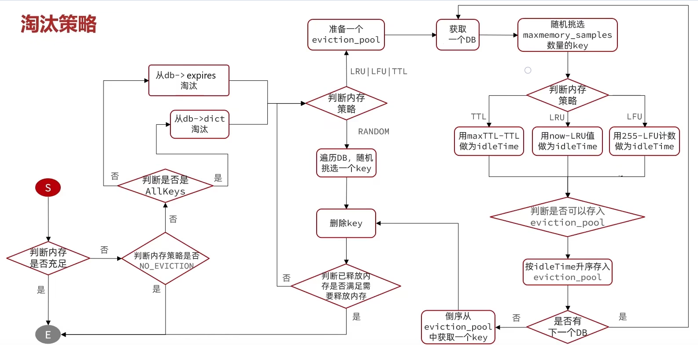

# 高级篇（六）Redis 原理篇（四）内存策略

## 1. 过期策略

### 1.1 Redis db

Redis本身是一个典型的key-value内存存储数据库，因此所有的key、value都保存在之前学习过的Dict结构中。不过在其database结构体（0-15每个db就是一个该结构体实例）中，有两个Dict：一个用来记录key-value；另一个用来记录key-TTL。

key 过期后不会立即删除，而是采用惰性删除或周期删除。

### 1.2 惰性删除

并不是在TTL到期后就立刻删除，而是在访问一个key的时候，检查该key的存活时间，如果已经过期才执行删除。

### 1.3 周期删除

通过一个定时任务，周期性的**抽样**部分过期的key，然后执行删除。

执行周期有两种：

- SLOW 模式：Redis服务初始化函数initServer()中设置定时任务，按照server.hz的频率来执行过期key清理
- FAST 模式：Redis的每个事件循环前会调用beforeSleep()函数，执行过期key清理

SLOW模式规则：

- 执行频率受server.hz影响，默认为10，即每秒执行10次，每个执行周期100ms。
- 执行清理耗时不超过一次执行周期的25%.默认slow模式耗时不超过25ms
- 逐个遍历db，逐个遍历db中的bucket，抽取20个key判断是否过期
- 如果没达到时间上限（25ms）并且过期key比例大于10%，再进行一次抽样，否则结束

FAST模式规则（过期key比例小于10%不执行）：

- 执行频率受beforeSleep()调用频率影响，但两次FAST模式间隔不低于2ms
- 执行清理耗时不超过1ms
- 逐个遍历db，逐个遍历db中的bucket，抽取20个key判断是否过期，如果没达到时间上限（1ms）并且过期key比例大于10%，再进行一次抽样，否则结束

## 2. 淘汰策略

内存淘汰：就是当Redis内存使用达到设置的上限时，主动挑选部分key删除以释放更多内存的流程。

Redis会在处理客户端命令的方法processCommand()中尝试做内存淘汰。

Redis支持8种不同策略来选择要删除的key：

- noeviction： 不淘汰任何key，但是内存满时不允许写入新数据，默认就是这种策略。
- volatile-ttl： 对设置了TTL的key，比较key的剩余TTL值，TTL越小越先被淘汰
- allkeys-random：对全体key ，随机进行淘汰。也就是直接从db->dict中随机挑选
- volatile-random：对设置了TTL的key ，随机进行淘汰。也就是从db->expires中随机挑选。
- allkeys-lru： 对全体key，基于LRU算法进行淘汰
- volatile-lru： 对设置了TTL的key，基于LRU算法进行淘汰
- allkeys-lfu： 对全体key，基于LFU算法进行淘汰
- volatile-lfu： 对设置了TTL的key，基于LFI算法进行淘汰
  - LRU（Least Recently Used），最少最近使用（**不是最近最少使用**，不要搞错了）。用当前时间减去最后一次访问时间，这个值越大则淘汰优先级越高。
  - LFU（Least Frequently Used），最少频率使用。会统计每个key的访问频率，值越小淘汰优先级越高。

RedisObject 记录 LRU 或 LFU 数据：

LFU的访问次数之所以叫做**逻辑访问次数**，是因为并不是每次key被访问都计数，而是通过运算：

- 生成0~1之间的随机数R
- 计算 (旧次数 * lfu_log_factor + 1)，记录为P
- 如果 R < P ，则计数器 + 1，且最大不超过255
- 访问次数会随时间衰减，距离上一次访问时间每隔 lfu_decay_time 分钟，计数器 -1

---

> 作者: [姚保国](https://yaobg.github.io)  
> URL: https://yaobg.github.io/posts/notes/databases/redis/itheima_redis_lesson/advanced/7-redis-principle-4-memory-policy/  

