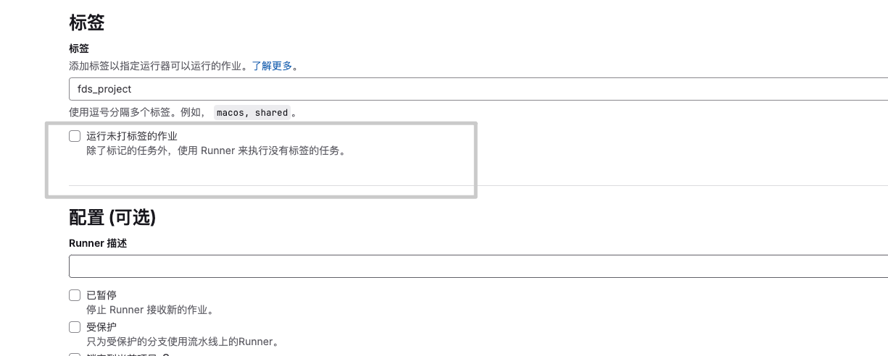
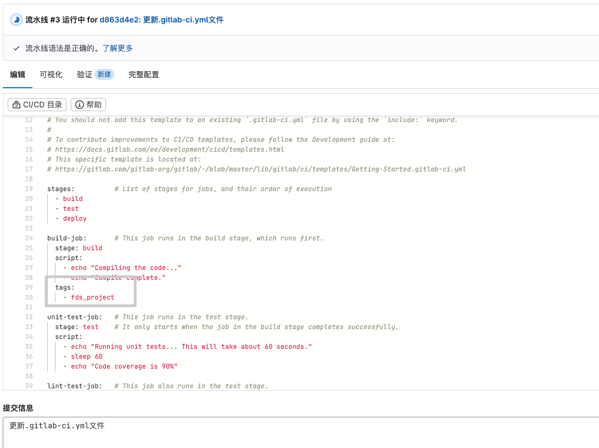
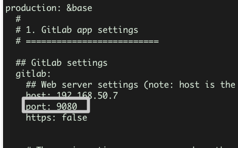

# GitLab 容器化部署指南


## 📚 前言

GitLab 是一个强大的 DevOps 平台，本文将详细介绍如何使用 Docker 部署和维护 GitLab 服务，帮助您快速构建安全、可靠的代码托管环境。

## 🚀 一、环境准备

### 1.1 系统要求

- CPU: 4核心及以上
- 内存: 最少 4GB，推荐 8GB
- 磁盘空间: 至少 50GB
- Docker 版本: 20.10 或更高

### 1.2 部署命令

```bash
docker run --detach \
  --hostname 192.168.50.7 \
  --publish 9043:443 --publish 9080:80 --publish 9022:22 \
  --name gitlab \
  --restart always \
  --volume /mnt/nfs/gitlab/config:/etc/gitlab \
  --volume /mnt/nfs/gitlab/logs:/var/log/gitlab \
  --volume /mnt/nfs/gitlab/data:/var/opt/gitlab \
  gitlab/gitlab-ce:latest
```

### 1.3 参数说明

| 参数 | 说明 | 建议值 |
|------|------|--------|
| hostname | 访问地址 | 公网IP或域名 |
| publish | 端口映射 | 建议使用非标准端口 |
| volume | 数据持久化 | 建议使用 SSD 存储 |

> ⚠️ **安全提示**：避免使用 10080 端口，该端口可能被浏览器识别为不安全端口

## ⚙️ 二、配置优化

### 2.1 基础配置

```bash
# 进入容器
docker exec -it gitlab bash
```

### 2.2 核心配置

编辑 `/etc/gitlab/gitlab.rb`：

```ruby
# 基础配置
external_url 'http://192.168.50.7:9080'

# SSH 服务配置
gitlab_rails['gitlab_ssh_host'] = '192.168.50.7'
gitlab_rails['gitlab_shell_ssh_port'] = 9022

# 系统优化配置
gitlab_rails['time_zone'] = 'Asia/Shanghai'
unicorn['worker_timeout'] = 60
unicorn['worker_processes'] = 3

# 备份策略配置
gitlab_rails['manage_backup_path'] = true
gitlab_rails['backup_archive_permissions'] = 0644
gitlab_rails['backup_keep_time'] = 604800  # 7天保留期
```

### 2.3 应用配置

```bash
# 重载配置
gitlab-ctl reconfigure

# 重启服务
gitlab-ctl restart
```

## 💾 三、备份方案

### 3.1 手动备份

```bash
# 方式一：容器内执行
docker exec -it gitlab bash
gitlab-rake gitlab:backup:create

# 方式二：一键备份
docker exec gitlab gitlab-rake gitlab:backup:create
```

### 3.2 自动备份

创建备份脚本 `/mnt/nfs/gitlab.backup.sh`：

```bash
#!/bin/bash
# GitLab 自动备份脚本
# 作者: Your Name
# 更新时间: 2024-03-xx

case "$1" in
  start)
    echo "开始备份 GitLab..."
    docker exec gitlab gitlab-rake gitlab:backup:create
    echo "备份完成!"
    ;;
esac
```

配置定时任务：

```bash
# 编辑定时任务
crontab -e

# 每天凌晨 2 点执行备份
0 2 * * * /mnt/nfs/gitlab.backup.sh start >> /var/log/gitlab-backup.log 2>&1
```

## 🔧 四、故障排查

### 4.1 密码查看

```bash
docker exec -it gitlab bash
cat /etc/gitlab/initial_root_password
```

### 4.2 Runner 问题

**现象**：CI/CD 作业阻塞，无可用 Runner

**解决方案**：

1. Runner 设置优化
   

2. CI 配置调整
   

### 4.3 克隆端口问题

1. 修改配置：
```bash
vi /opt/gitlab/embedded/service/gitlab-rails/config/gitlab.yml
```

2. 端口更新：
   

3. 服务重启：
```bash
gitlab-ctl restart
```

## 📋 五、最佳实践

### 5.1 安全建议

- 启用 HTTPS
- 定期更新密码
- 配置防火墙规则
- 启用双因素认证

### 5.2 性能优化

- 合理配置 worker 进程
- 定期清理未使用的数据
- 监控系统资源使用

### 5.3 运维建议

1. 建立备份验证机制
2. 定期检查系统日志
3. 制定故障恢复预案
4. 保持版本及时更新

## 📞 六、帮助支持

如遇问题，请参考：
- [GitLab 官方文档](https://docs.gitlab.com/)
- [Docker Hub](https://hub.docker.com/r/gitlab/gitlab-ce)
- [社区支持](https://forum.gitlab.com/)

---

> 🔔 **温馨提示**：部署完成后，请及时修改默认密码并配置安全策略。

---

> 作者:   
> URL: https://yaobg.github.io/posts/notes/devops/docker/mirror/1-gitlab/  

