# Jenkins保姆级安装教程


<!--more-->

## jenkins
### 安装
1、创建docker-compose文件
```bazaar
services:
  jenkins:
    image: jenkins/jenkins:2.452.3-lts
    container_name: jenkins
    restart: on-failure
    user: "0"
    environment:
      - JAVA_OPTS=-Duser.timezone=Asia/Shanghai
    ports:
      - "8082:8080"
      - "50000:50000"
    volumes:
      - /mnt/nfs/jenkins_home:/var/jenkins_home
      - /etc/localtime:/etc/localtime
      - /usr/bin/docker:/usr/bin/docker
      - /var/run/docker.sock:/var/run/docker.sock
      - /usr/local/bin/kubectl:/usr/bin/kubectl
      - /usr/sbin/helm:/usr/bin/helm
      - $HOME/.kube:$HOME/.kube
      - /usr/local/maven-3.9:/usr/local/maven-3.9                                                                                                                                                                                             
```
指令解析：

- -d ：后台运行容器
- -p：端口映射， 左边是本地端口，右边是docker容器端口 ，8080是Jenkins Web 界面的工作端口,50000是JNLP（Java Network Launch Protocol）工作端口。这个端口用于 Jenkins 节点和主控节点之间的通信。
- -v ：目录挂载，将主机上的 /mnt/nfs/jenkins_home 目录挂载到容器内的 /var/jenkins_home 目录，用于持久化 Jenkins 的数据。/etc/localtime:/etc/localtime：将本地主机上的时区信息文件挂载到容器内的 /etc/localtime 文件中，确保容器内的时间与主机上的时间一致
- -v /usr/bin/docker:/usr/bin/docker: 将主机上的 /usr/bin/docker 文件挂载到容器中的 /usr/bin/docker，这样容器内的 Jenkins 可以直接使用宿主机上的 Docker 命令。在使用 GitLab/Jenkins 等 CI 软件的时候需要使用 Docker 命令来构建镜像，需要在容器中使用 Docker 命令；通过将宿主机的 Docker 共享给容器
- -v /var/run/docker.sock:/var/run/docker.sock: 将主机上的 Docker socket 文件挂载到容器中的相同位置，这样容器内的 Jenkins 可以与宿主机上的 Docker 引擎进行通信。
- -v /usr/bin/kubectl:/usr/bin/kubectl: 挂载kubectl与k8s通信
- -v /usr/sbin/helm:/usr/bin/helm : 挂载helm
- –restart=on-failure：设置容器的重启策略为在容器以非零状态退出（异常退出）时重启。
- -u 0：将容器内进程的用户身份设置为 root 用户，等同于-u root。
- -–name jenkins：给容器指定一个名称为 jenkins。

**2、启动Jenkins容器**
```shell
docker-compose up d-d
```

**3、验证Jenkins容器是否启动成功**
```shell
docker ps 
```
如果已经运行，会输出jenkins容器的相关信息
```shell
CONTAINER ID   IMAGE                                 COMMAND                  CREATED          STATUS                PORTS                                                                                                                         NAMES
0de7b0a81cb1   jenkins/jenkins:2.426.2-lts           "/usr/bin/tini -- /u…"   36 seconds ago   Up 36 seconds         0.0.0.0:50000->50000/tcp, :::50000->50000/tcp, 0.0.0.0:8082->8080/tcp, [::]:8082->8080/tcp
```
**4、获取管理员密码**
我们在进入Jenkins的管理页面的时候，是需要管理员密码，所以我们需要获取管理员密码

获取管理员密码有两种方式

- 查看日志

使用下面命令查看jenkins的输出日志，jenkins是我们在启动jenkins时给jenkins指定的容器名
```shell
docker logs jenkins
```
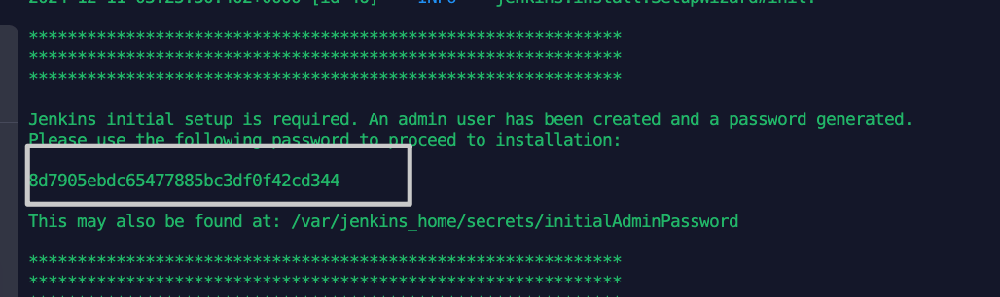
- 查看文件
不看日志，我们也可以直接查看/var/jenkins_home/secrets/initialAdminPassword文件，这个目录在我们进入jenkins 管理页面时会看到

**5、修改插件源**

Jenkins在安装插件时，下载相关插件包特别慢，我们可以将Jenkins默认的插件数据源变更为国内数据源，然后重启Jenkins
```shell
#进入更新配置目录
cd {你的Jenkins工作目录}/updates
# 我这工作目录
cd /mnt/nfs/jenkins_home/updates
```
使用下面命令替换default.json文件中指定的源
```shell
sed -i 's/http:\/\/updates.jenkins-ci.org\/download/https:\/\/mirrors.tuna.tsinghua.edu.cn\/jenkins/g' default.json && sed -i 's/http:\/\/www.google.com/https:\/\/www.baidu.com/g' default.json
```
修改下载地址
```shell
cd {你的Jenkins工作目录}/
```
找到下面这个文件 hudson.model.UpdateCenter.xml文件
```shell
<?xml version='1.1' encoding='UTF-8'?>
<sites>
  <site>
    <id>default</id>
    <url>https://updates.jenkins.io/update-center.json</url>
  </site>
</sites>      
```
将url替换为http://mirror.esuni.jp/jenkins/updates/update-center.json
```shell
<?xml version='1.1' encoding='UTF-8'?>
<sites>
  <site>
    <id>default</id>
    <url>http://mirror.esuni.jp/jenkins/updates/update-center.json</url>
  </site>
</sites>
```
**7、登录web页面**

使用ip:8082，8082就是我们主机映射到容器8080的端口，如果你使用的是其他端口，那么需要换成其他端口

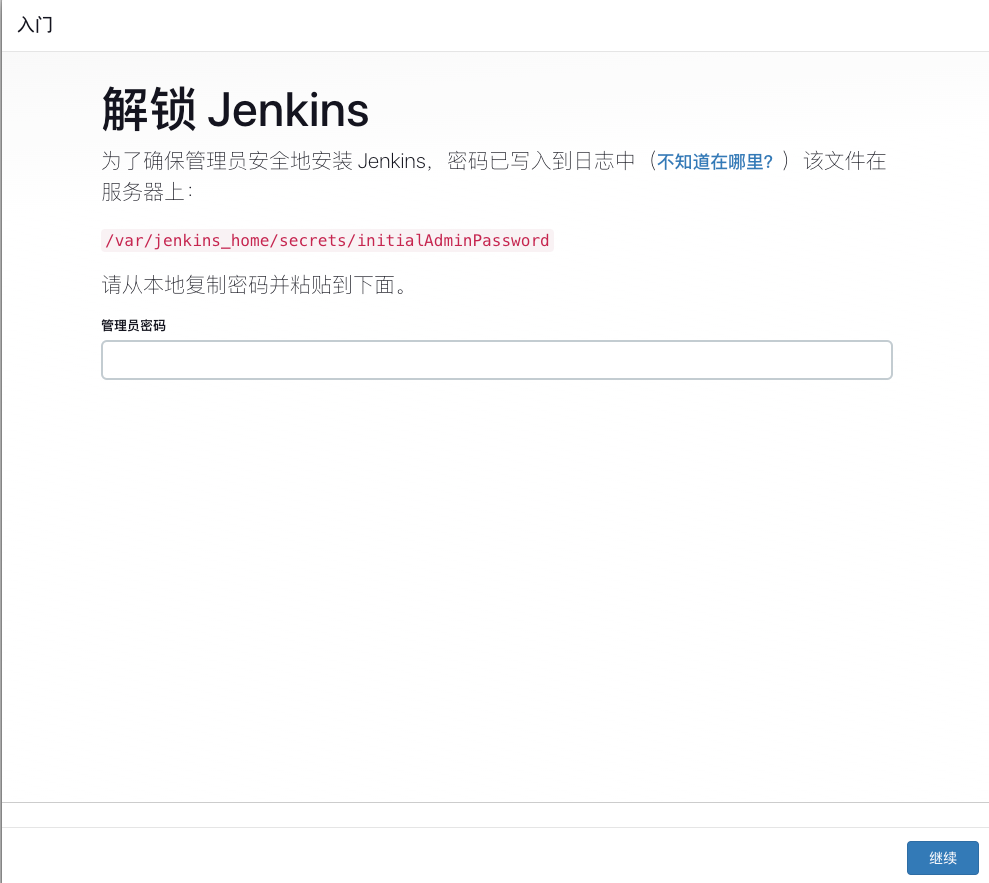

输入密码之后，就可以安装插件，直接选择安装推荐的插件即可

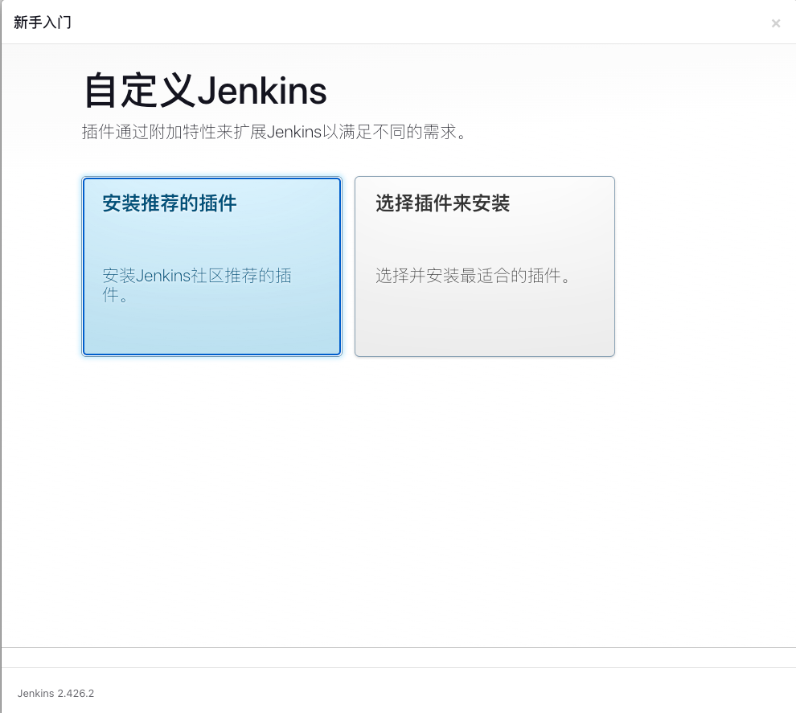

**8、插件推荐**

除了推荐插件之外，下面是一些常用插件，大家按需安装

- Locale（中文插件）
- Gitlab Plugin （拉取 gitlab 中的源代码） 
- Maven Integration（maven构建工具） 
- NodeJs（node构建工具）
- Publish Over SSH（远程推送工具） 
- Role-based Authorization Strategy（权限管理） 
- Deploy to container（自动化部署工程所需要插件，部署到容器插件） 
- git parameter（用户参数化构建过程里添加git类型参数）
- Kubernetes (k8s)
- Version Number（构建版本号控制）

  | **变量名称**            | **功能说明**                                                                                                                                                                                                                           |
  |-------------------------|-------------------------------------------------------------------------------------------------------------------------------------------------------------------------------------------------------------------------------------|
  | `BUILD_DATE_FORMATTED`  | 如果此参数是用引号括起来的 JAVA 日期格式字符串，则它将替换为以该字符串格式化的构建日期。如果没有参数，则使用标准简单日期格式。例如：`${BUILD_DATE_FORMATTED, "yyyy-MM-dd"}`。                                                          |
  | `BUILD_DAY`             | 返回构建的一天作为整数。如果有参数，则指定字符数并使用填充日期字符串。例如：`${BUILD_DAY}` 返回 `3`，`${BUILD_DAY, X}` 返回 `3`，`${BUILD_DAY, XX}` 返回 `03`。                                                                    |
  | `BUILD_WEEK`            | 返回当前周数，参数约定与 `BUILD_DAY` 相同。                                                                                                                                                                                         |
  | `BUILD_MONTH`           | 返回当前月份，参数约定与 `BUILD_DAY` 相同。                                                                                                                                                                                        |
  | `BUILD_YEAR`            | 返回当前年份，参数约定与 `BUILD_DAY` 相同。                                                                                                                                                                                        |
  | `BUILDS_TODAY`          | 返回今天发生的构建数量，包括当前构建。这在午夜重置。参数约定与 `BUILD_DAY` 相同。                                                                                                                                                   |
  | `BUILDS_THIS_WEEK`      | 返回本周发生的构建数量，包括当前构建。这在每周的开始时重置。参数约定与 `BUILD_DAY` 相同。                                                                                                                                           |
  | `BUILDS_THIS_MONTH`     | 返回本月发生的构建数量，包括当前构建。这在每月的第一天重置。参数约定与 `BUILD_DAY` 相同。                                                                                                                                           |
  | `BUILDS_THIS_YEAR`      | 返回今年发生的构建数量。这在每年的第一天重置。参数约定与 `BUILD_DAY` 相同。                                                                                                                                                        |
  | `BUILDS_ALL_TIME`       | 返回自项目开始以来发生的构建数量。这可以与 Hudson 内部版本号不同，因为它可以定期重置（例如，从 1.0 移到 2.0）。可以配置为以任意数字开始而不是标准日期。例如：`${BUILDS_ALL_TIME}`。                                                 |
  | `MONTHS_SINCE_PROJECT_START` | 自项目开始日期以来的月数。这基于当前构建的月份和项目开始日期的月份。例如：项目从 10 月 31 日开始，并在 11 月 1 日构建，将返回 `1`。参数约定与 `BUILD_DAY` 相同。                                                              |
  | `YEARS_SINCE_PROJECT_START`  | 自项目开始日期以来的年数。这仅依赖于年份。例如：项目从 2022 年开始，当前年份为 2024 年，则返回 `2`。参数约定与 `BUILD_DAY` 相同。                                                                                            |
  | **其他**               | 在 `${}` 中包含的其他参数将被替换为具有相同名称的环境变量（如果存在），否则将被忽略。例如，这可以用于集成源代码控制版本号。                                                                                                           |

pipeline写法
```
  VERSION = VersionNumber(
            projectStartDate: '1970-12-12',
            versionNumberString: '0.0.${BUILD_ID}',
            versionPrefix: '',
            worstResultForIncrement: 'SUCCESS'
        )
```

- Extended Choice Parameter（扩展了原生参数化构建的功能）
- Active Choices（参数联动功能）
- Build Pipeline （用于可视化展示多个作业（Jobs）之间的依赖关系和执行状态。它帮助用户创建、监控和管理流水线工作流，特别适合分阶段的构建流程，例如代码编译、测试、部署等）
- AnsiColor（改变控制台颜色）
- timestamper（构建显示时间）
- Blue Ocean（流水线的可视化和管理变得更加简单和直观）
- Customized Build (可以在右侧显示构建的变量)


```bazaar
 post {
        always {
            // 清理临时文件
            cleanWs()
        }
        success {
            script {
                currentBuild.description = "分支:${BRANCH_NAME} \n 标签:${TAG} \n 版本: ${env.VERSION}"
            }
        }
    }
```
- Docker Pipeline（插件允许你在Pipeline中使用Docker，支持构建Docker镜像和在Docker容器中运行构建）
```bazaar
pipeline {
    agent {
        docker {
            image 'maven:3.6.3-jdk-11' 
            args '-v /var/run/docker.sock:/var/run/docker.sock' 
        }
    }
    stages {
        stage('Build') {
            steps {
                sh 'mvn clean package'
            }
        }
    }
}
```
### 配置插件
#### gitlab
注意：需要先安装上面的Gitlab Plugin插件

**1、gitlab生成授权令牌**

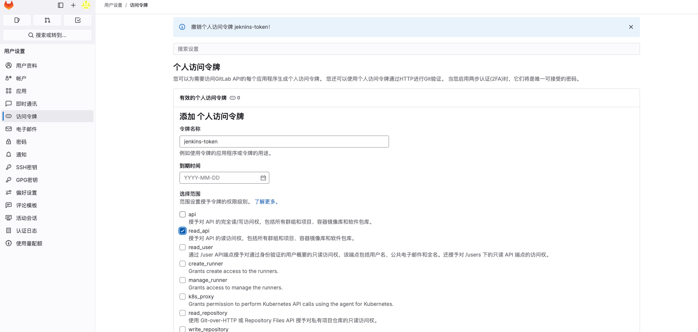

**2、获取授权的令牌**

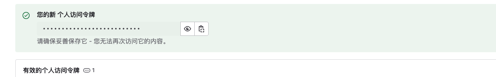

**3、jenkins配置令牌**

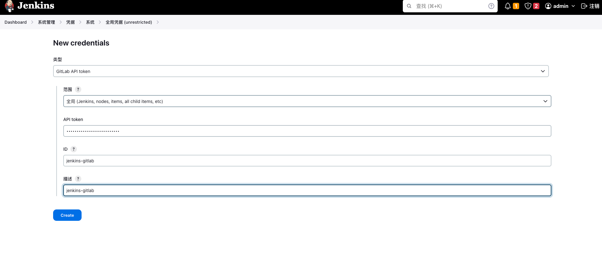

**4、配置gitlab授权**

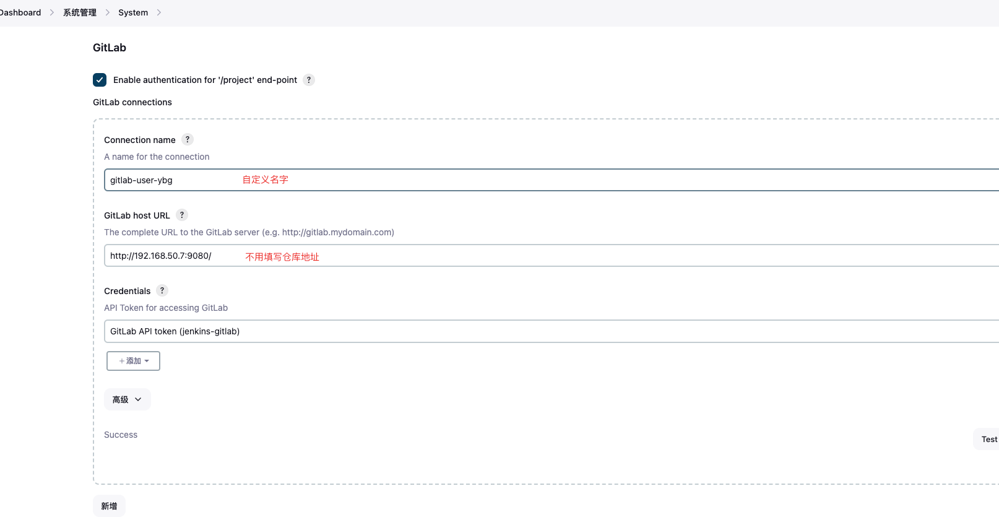

**5、配置git 账户来拉取代码**

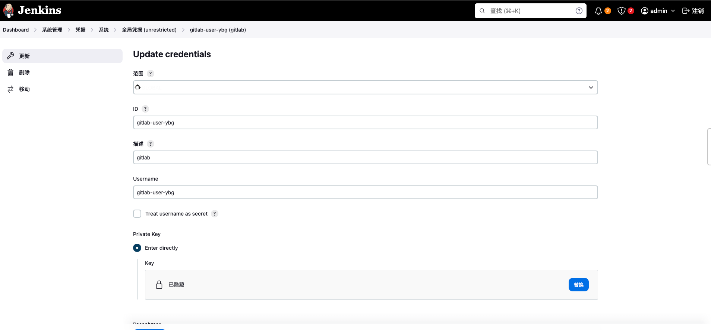

#### harbor
和gitlab一样，在凭证新增harbor凭证

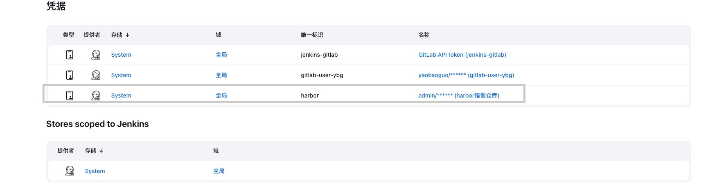

#### maven
进入 系统管理->全局管理

**1、设置maven setting.xml**

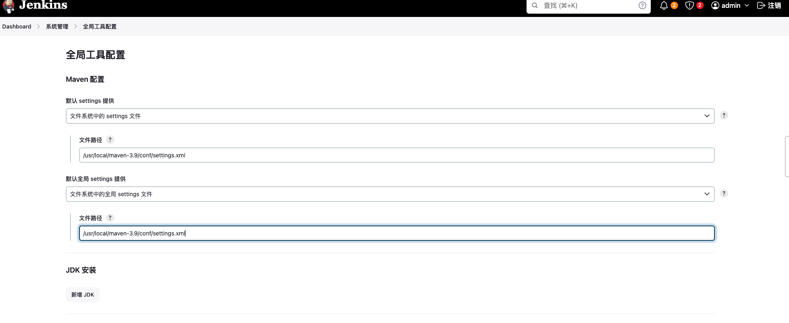

**2、设置maven目录**

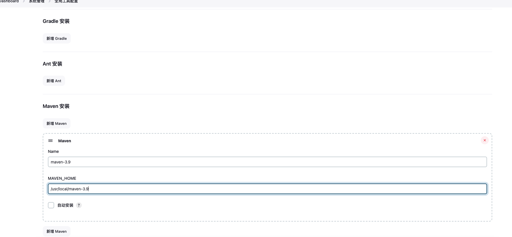

### 项目
#### 构建
本文章采用构建一个自由风格的项目为例子
```shell
pipeline {
    agent any
    tools {
        maven 'maven-3.9'  // Maven 的名称需与全局工具配置中一致
    }
    options {
        timestamps()  // 为所有步骤启用时间戳
    }
    parameters {
        string(name: 'BRANCH_NAME', defaultValue: 'dev', description: 'Git branch')
        string(name: 'TAG', defaultValue: 'latest', description: 'Git Tag')
    }
    environment {
        GIT_URL = 'http://192.168.50.7:9080/wx-ai/data-platform-server.git'
        CREDENTIALSID = 'gitlab-user-ybg' // Git 凭据 ID
        VERSION = VersionNumber(
            projectStartDate: '1970-12-12',
            versionNumberString: '0.0.${BUILDS_ALL_TIME}',
            versionPrefix: '',
            worstResultForIncrement: 'SUCCESS'
        )
        HARBOR_REPO = "192.168.50.7/dev/data-platform-server:${env.VERSION}"  // Harbor 的 Docker 仓库地址
    }
    stages {
        stage('拉取代码') {
            steps {
                script {
                    // 检出代码
                    git credentialsId: env.CREDENTIALSID, url: env.GIT_URL, branch: params.BRANCH_NAME
                    if (params.TAG && params.TAG.startsWith("v")) {
                        echo "Checking out Git Tag: ${params.TAG}"
                        sh "git fetch --tags"
                        sh "git checkout tags/${params.TAG}"
                    }
                }
            }
        }
        stage('Maven Build') {
            steps {
                script {
                    // 使用 Maven 打包并重命名为 app.jar
                    sh """
                    echo "Starting Maven Build..."
                    mvn clean package -DskipTests -e -X
                    """
                }
            }
        }
        stage('编译镜像') {
            steps {
                script {
                    // 构建 Docker 镜像
                    sh """
                    ls -lh target
                    echo "Building Docker image: ${HARBOR_REPO}"
                    docker build -t ${HARBOR_REPO} .
                    """
                }
            }
        }
        stage('推送harbor') {
            steps {
                script {
                    // 登录并推送镜像到 Harbor
                    withCredentials([usernamePassword(credentialsId: 'harbor', passwordVariable: 'HARBOR_PASSWORD', usernameVariable: 'HARBOR_USERNAME')]) {
                        sh """
                        echo "Logging into Harbor..."
                        docker login 192.168.50.7 -u ${HARBOR_USERNAME} -p ${HARBOR_PASSWORD}
                        echo "Pushing Docker image to Harbor..."
                        docker push ${HARBOR_REPO}
                        """
                    }
                }
            }
        }
        stage('Deploy with Helm') {
            steps {
                script {
                    // 使用 Helm 部署
                    sh """
                    echo "Deploying with Helm..."
                    helm upgrade --install data-platform-server deploy/k8s-helm --namespace dev --set image.repository=${HARBOR_REPO}
                    """
                }
            }
        }
    }
    post {
        always {
            // 清理临时文件
            cleanWs()
        }
    }
}
```
#### 回滚

### 常见问题
1、jenkins插件安装超时
* Dashboard > 插件管理 > 高级 > 升级站点 > URL
* URL更改为http://mirror.esuni.jp/jenkins/updates/update-center.json

2、不知道如何编写pipeline

点击项目项目的流水线语法

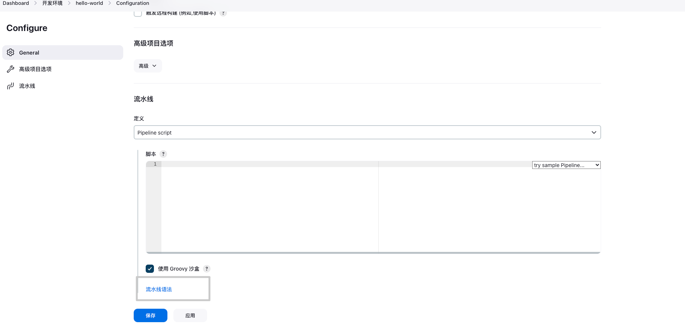

生成自己需要的语法

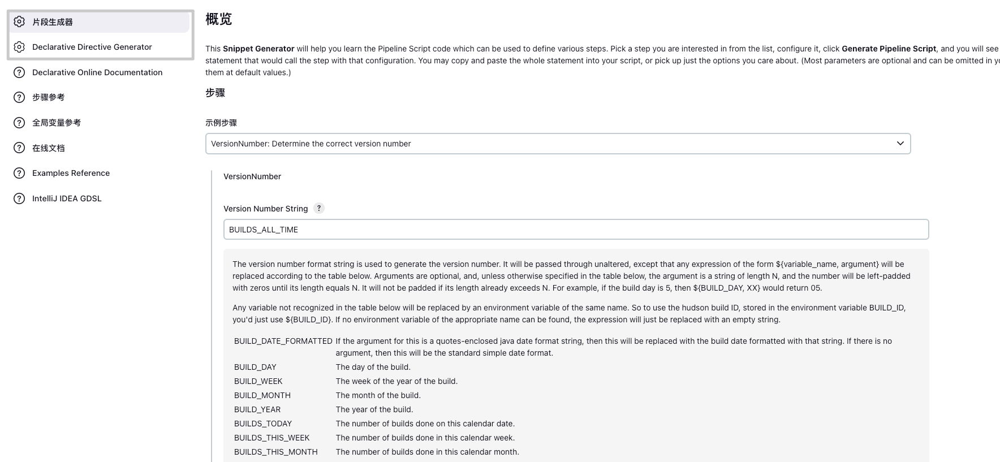


---

> 作者: [姚保国](https://yaobg.github.io)  
> URL: https://yaobg.github.io/posts/notes/devops/docker/mirror/2-jenkins/  

