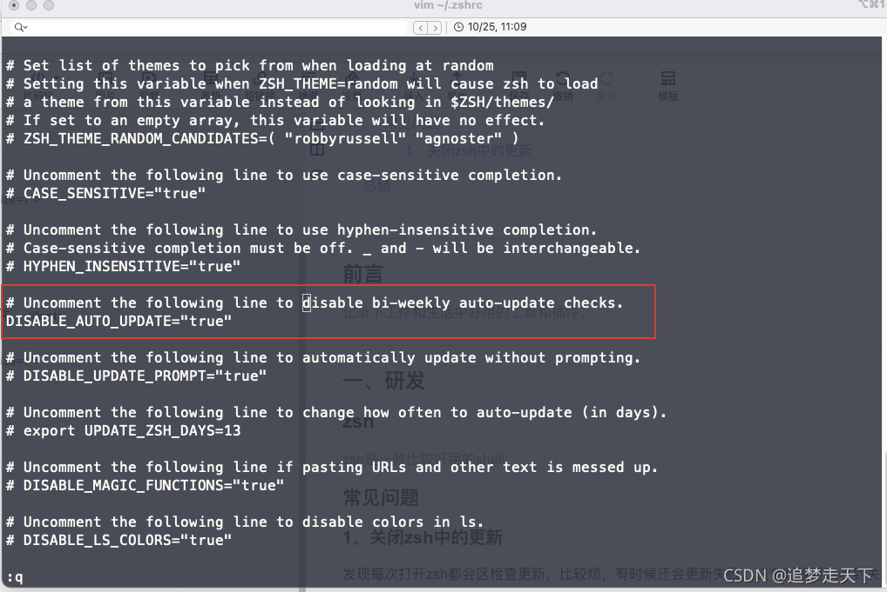

# Mac 软件


## 前言

记录下工作和生活中好用的工具和插件。

## 终端

### zsh

zsh是一款比较好用的shell，可以提升工作效率。

#### plugins（插件）

下图是我常用的工作插件：
```zsh
plugins=(git
        zsh-completions
        zsh-autosuggestions
        docker
        zsh-syntax-highlighting
        macos
        brew)
```

#### 常见问题

1、关闭zsh中的更新
发现每次打开zsh都会区检查更新，比较烦，有时候还会更新失败，这个时候可以收到关闭更新：


```bash
打开 DISABLE_AUTO_UPDATE="true" 即可
```

2、oh-my-zsh 更新超时或者失败
鉴于某种原因，github访问会很慢，有时候oh-my-zsh会更新失败，如果想更新可以执行以下命令：

```bash
omz update
或者
cd ~/.oh-my-zsh/tools/
./upgrade.sh
```

## 总结

后续会逐步对这个文章进行更新

---

> 作者:   
> URL: http://localhost:1313/posts/tools/mac/  

